基于k8s开发的一套Paas系统


# 技术栈

后端： springboot + kubernetes + springsecurity + jwt + websocket

前端： vue + echarts + element-ui + xterm


# 部署

## 前端部署

```javascript
npm install
npm run serve
```

## 后端

```java
java -jar xxx.jar
```


# 效果展示：

## 1.登录界面 


## 2. 系统管理

### 2.1  管理员列表

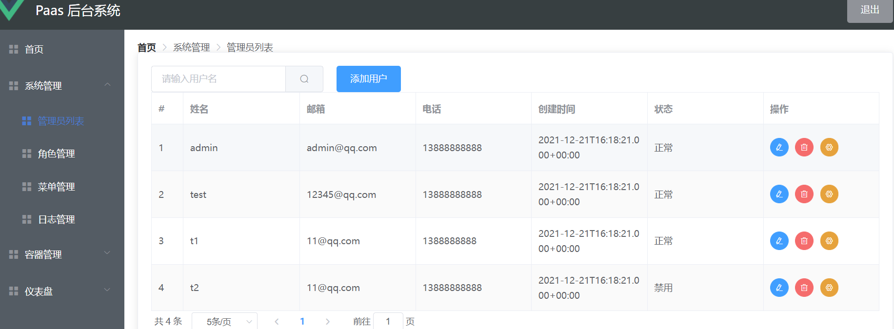

### 2.2 角色管理

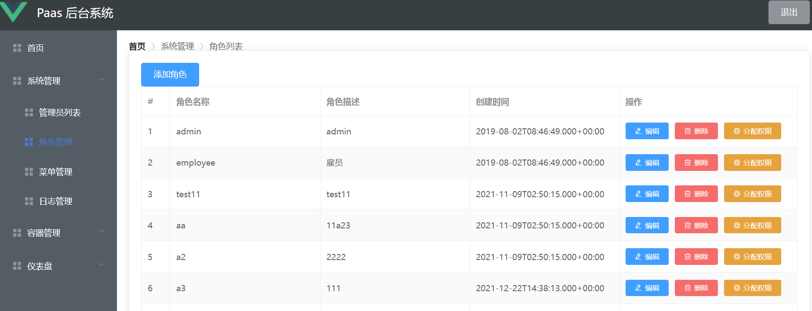

### 2.3 菜单管理

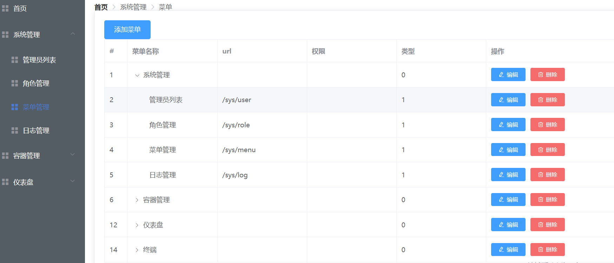

### 2.4 日志管理

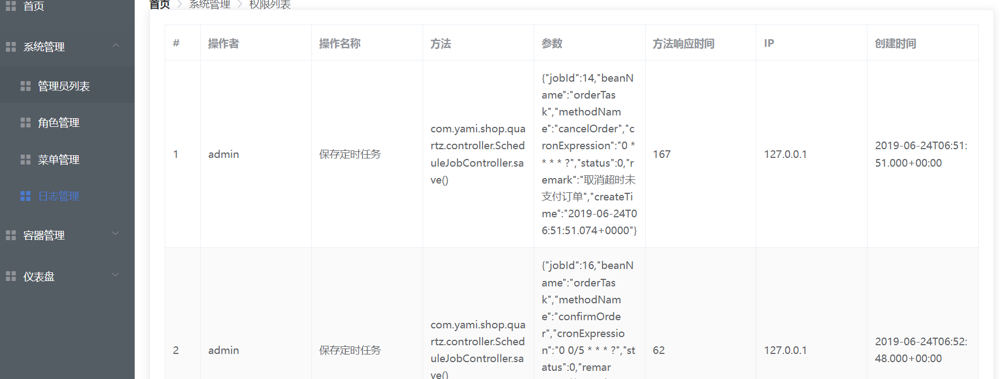 


# 3. 容器管理 

### 3.1 Node管理

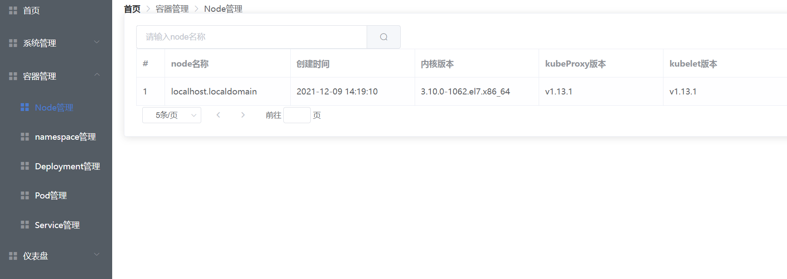

3.2 Namespace 管理

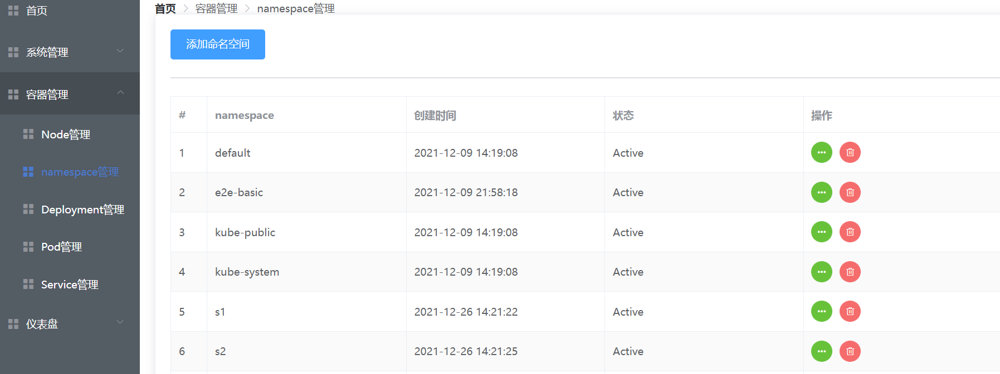


3. 3 Deployment管理

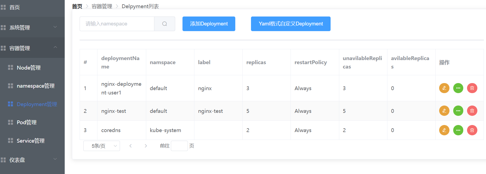


3.4 Pod 管理

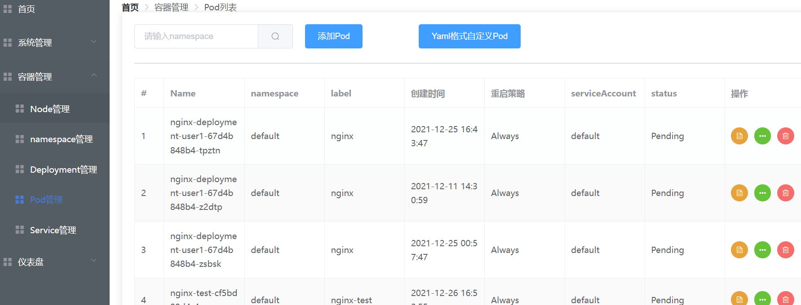


3.5 Service 管理

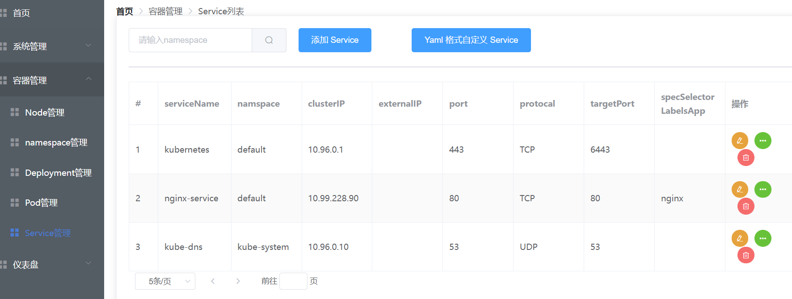


## 4. 仪表盘

### 4.1 访问量

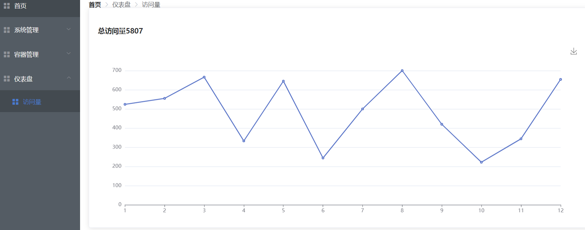


# 5. 终端 

### 5.1 终端

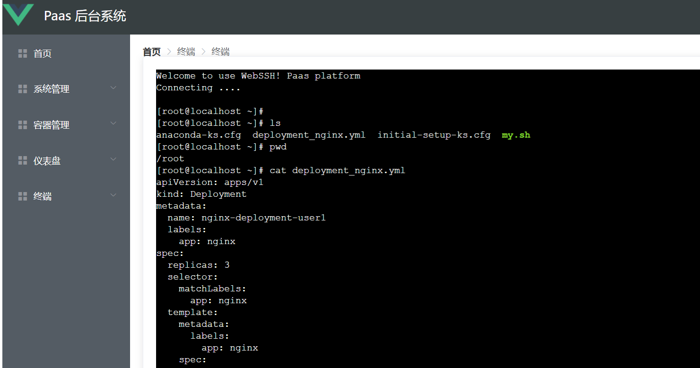
