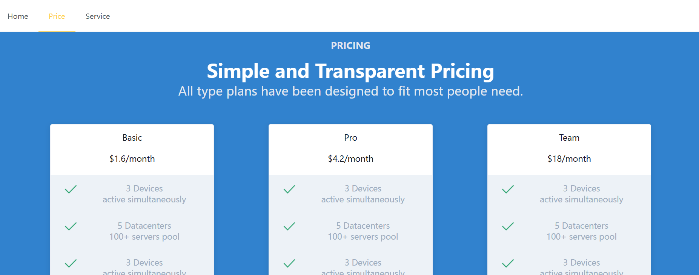
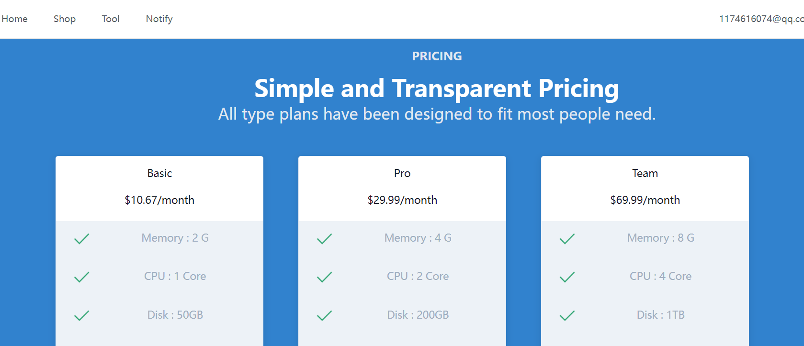
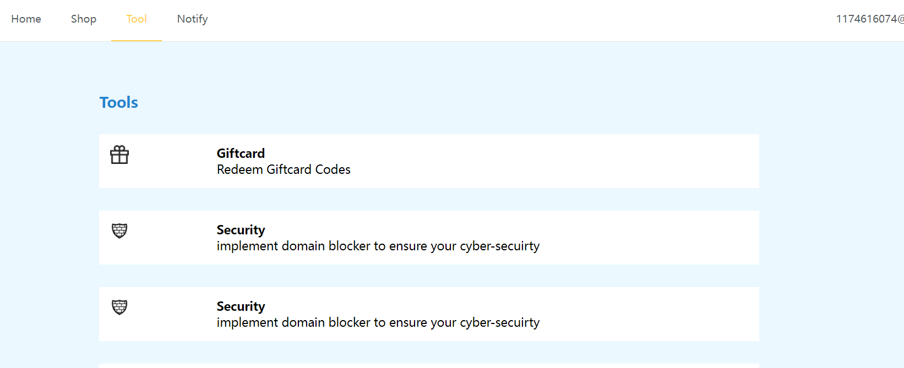
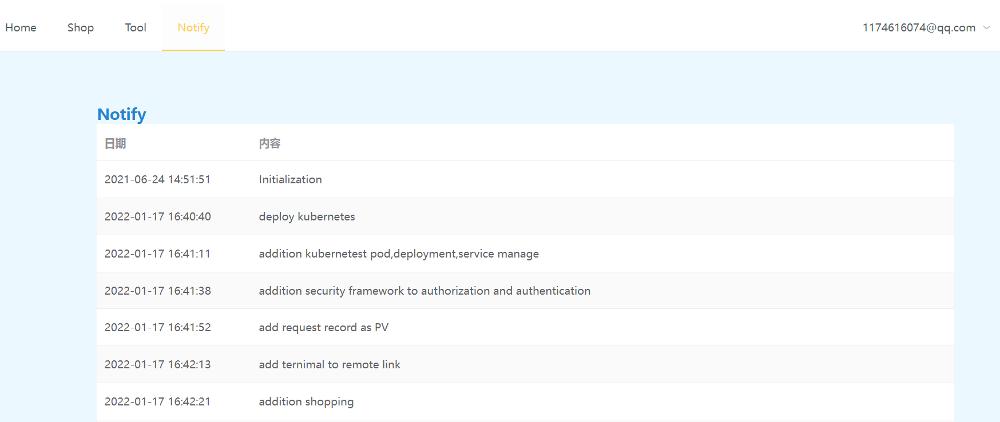
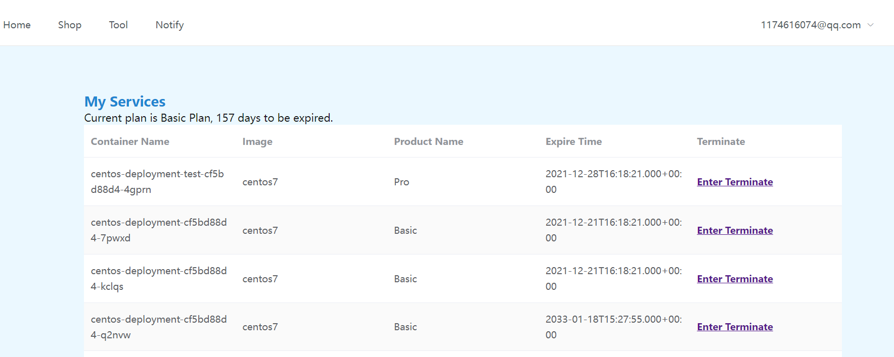

一套基于kubernetes开发的Paas系统。


paas-ind :  Paas 服务个人版，包含对kubernetes 的Pod 、Service、Deployment 等操作，同时基于RBAC实现权限控制，同时可统计站点访问量，以及远程接入终端


# 技术栈

后端： springboot + mybatis + kubernetes + springsecurity + jwt + websocket

前端： vue + echarts + element-ui + xterm


## 使用Jedis 而不使用 StringRedisTemplate原因

1，个人认为直接使用JedisPool比使用SpringBoot封装的RedisTemplate好用，而且效率高很多（相同的数据量至少5倍以上的差距，本机实测感觉jedis快了几十倍，get一个key,value为有一万多条数据的json，用RedisTemplate 在idea中单步调试在get这行的时候明显的卡半天才反应过来，至少3-5s以上，前后反复测试了十几次都是这样,但是使用jedis则是瞬间出来，进入下一行代码。相同的一个key数据存入redis后，使用同样的Windows redis cli客户端在服务端去get, 用RedisTemplate存入的显示为1.27s,而jedis存入的0.92s）这也是看得见的区别。如果是几十万的话区别就更大了。

2，jedis存入的字符串数据不会被添加转义符，用Windows redis cli客户端手工从服务端set的数据也可以在java jedis中正确读取出来，而使用RedisTemplate则读不了。

3，jedis默认不支持set object类型。而RedisTemplate 因为是二次封装是可以的。如果jedis要实现这功能，可以自己封装，因为jedis提供了set(byte[] key, byte[] value)，可以将要存的对像或bean序列化为string再存入，又或者转为byte[]再存入均可。

4，存入相同数量的List<bean>，比如15000条，同样使用fastjson序列化存入，RedisTemplate存入的字符量至少要比使用jedis存入的多5分之一，在cli 客户端查询只看见铺天盖地的\\\\\转义符，而jedis存入的则低调很多。序列化器均为fastjson1.2.7。

5，关于线程安全，都说jedis线程不安全。lettuce是线程安全的。高并发效率高如何如何。其实本身这个问题并不算问题。因为redis默认即为单线程，但单线程并不代表效率低,像Nginx、Nodejs也是单线程程序,但是它们的效率并不低。而且使用jedis访问redis我相信大家基本都是采用JedisPool连接池来操作的，这样一来发生并发访问冲突的机率就不存在了，这个不明白的可以去了解一下JedisPool，jedis实例的相关概念和工作原理。

6， jedis本身不是多线程安全的，这并不是jedis的bug，而是jedis的设计与redis本身就是单线程相关，jedis实例抽象的是发送命令相关，一个jedis实例使用一个线程与使用100个线程去发送命令没有本质上的区别，所以没必要设置为线程安全的。但是如果需要用多线程方式访问redis服务器怎么做呢？那就使用多个jedis实例，每个线程对应一个jedis实例，而不是一个jedis实例多个线程共享。一个jedis关联一个Client，相当于一个客户端，Client继承了Connection，Connection维护了Socket连接，对于Socket这种昂贵的连接，一般都会做池化，jedis提供了JedisPool。

虽然现在主流都在使用RedisTemplate，但是我个人还是比较推荐直接使用jedispool来操作redis。关于他们效率的对比，网上测试是一堆一堆的可以自己去找。几乎都是5-100倍的性能差距！


# 部署

导入paas_db.sql文件

## 前端部署

```javascript
npm install
npm run serve
```

## 后端

```java
java -jar xxx.jar
```


后台管理默认                           账号： admin  密码：admin


## 前台效果展示：

### 1. 首页


 


### 2. 登录页面


### 3. 产品





### 4. 工具




### 5. 通知



### 6. 我的




# 后台效果展示：

## 1.登录界面 


## 2. 系统管理

### 2.1  管理员列表


### 2.2 角色管理


### 2.3 菜单管理


### 2.4 日志管理

 


# 3. 容器管理 

### 3.1 Node管理


3.2 Namespace 管理


3. 3 Deployment管理


3.4 Pod 管理


3.5 Service 管理


## 4. 仪表盘

### 4.1 访问量


# 5. 终端 

### 5.1 终端


## 6. 商品

### 6.1 产品


### 6.2 产品属性


### 6.3 SKU


## 7. 兑换券

### 7.1 兑换券


