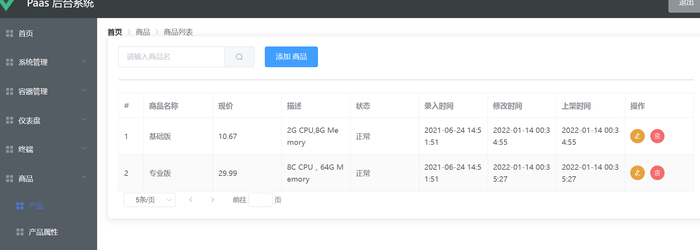
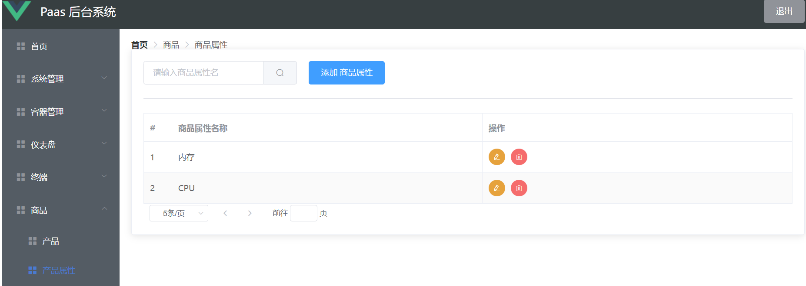
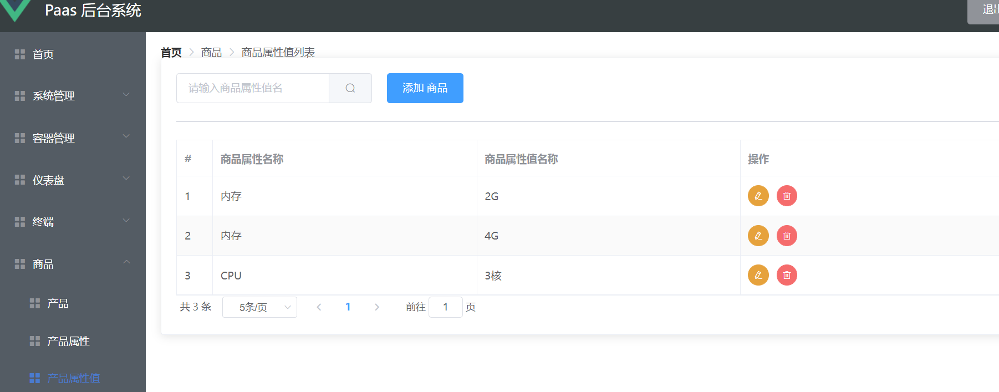
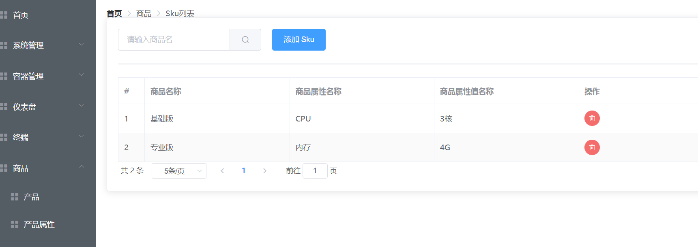
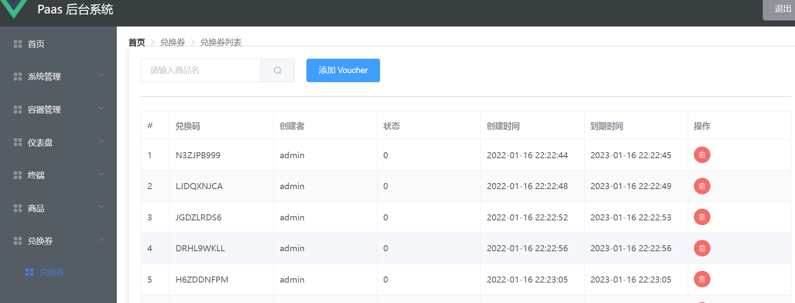

一套基于kubernetes开发的Paas系统。


paas-ind :  Paas 服务个人版，包含对kubernetes 的Pod 、Service、Deployment 等操作，同时基于RBAC实现权限控制，同时可统计站点访问量，以及远程接入终端


# 技术栈

后端： springboot + mybatis + kubernetes + springsecurity + jwt + websocket

前端： vue + echarts + element-ui + xterm


# 部署

导入paas_db.sql文件

## 前端部署

```javascript
npm install
npm run serve
```

## 后端

```java
java -jar xxx.jar
```


# 效果展示：

## 1.登录界面 


## 2. 系统管理

### 2.1  管理员列表


### 2.2 角色管理


### 2.3 菜单管理


### 2.4 日志管理

 


# 3. 容器管理 

### 3.1 Node管理


3.2 Namespace 管理


3. 3 Deployment管理


3.4 Pod 管理


3.5 Service 管理


## 4. 仪表盘

### 4.1 访问量


# 5. 终端 

### 5.1 终端


## 6. 商品

### 6.1 产品



### 6.2 产品属性






### 6.3 SKU




## 7. 兑换券

### 7.1 兑换券



